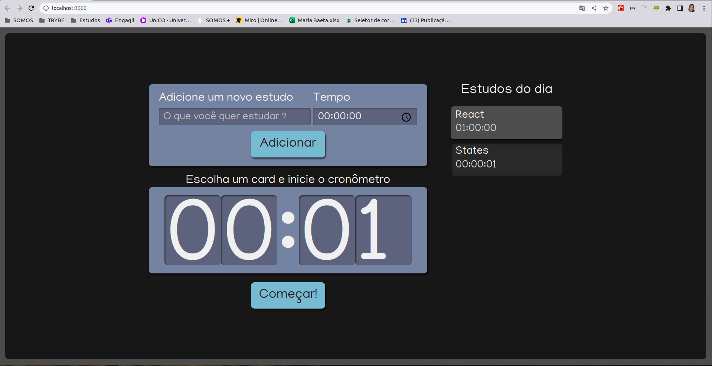
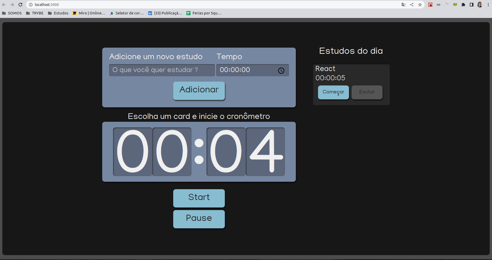

# Projeto Alura-studies

Projeto desenvolvido durante o curso **React: escrevendo com Typescript** oferecido pela plataforma **Alura**.

O curso tem como objetivo desenvolver as seguintes tecnologias: React e TypeScript.

Durante o curso:

- Crie um projeto React com Typescript do zero com Create React App;
- Aprendi conceitos de React como Componentização, Props e State;
- Utilizição de CSS Modules e SASS;
- Aprendi sobre os hooks useState e useEffect e como eles eram usados nos class components;
- Código desenvolvido com conceitos de boas práticas como DRY (Don't repeat yourself) e SRP (Single Responsibility Principle);

**Conslusão**: 04/08/2022

## O que foi proposto:

Criação de um modelo de TODO List básico que permite:

- Incluir tarefas a uma lista;
- Inciar contagem regressiva para execução da tarefa;
- Dar como concluida a tarefa ao fim do tempo.

Sugestões de melhorias implementadas por mim:

- Inclusão de botões: para Começar (botão que iniciar cronometragem das tarefas) e Excluir (exclui tarefa da lista) ;
- Inclusão de botão de Pause (que pausa a contagem regressiva)

## Preparando o projeto localmente

### **1º passo:** Baixe o projeto do git

Faça o clone do projeto pra sua máquina

- **URL**: https://github.com/maria-baeta/ts-studies.git

### **2º passo:** Instalando as dependências

Para instalar as dependências do projeto execute o comando:

```bash
$ yarn
```

## Executando localmente

Execute o comando abaixo:

```bash
$ yarn start
```

o VS-Code irá abrir uma instância do Chrome já na url:

```bash
hhttp://localhost:3000/
```

## Dificuldades

- Identificar os tipos referentes as props compartilhada pelos componentes.

## Aprendizados

- Como identificar os tipos especificos

## Como ficou?

Após a conclusão do curso:



O que adicionei:


